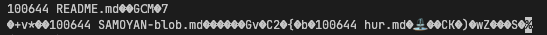
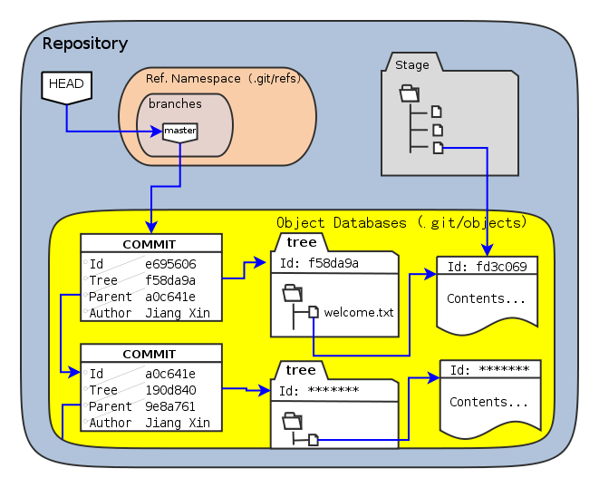

# Things to add into anki:

- What is Git? Git is a version control system which tracks any changes (files, folder/directory) made in a project.
- What is a Git Repository? It's the `.git` folder inside a project
- What is a `.git` folder? It's a content-addressable store (key-value pair) acting as a object database, containing a snapshot of the entire project, commits, and history.
- What makes a project a git repository?
  - A working tree: the directory which is being tracked
  - A `.git` folder: a child directory of the working tree which contains all the information of the working tree represented in different types of object
- What is a git object? Git objects are binary file that represent files and folders within a project. 
- Where is git objects located? It's located in the `.git/object` folder. The object name and path is identified by a SHA-1 hash which is derived from the contents of the file.
- What are the different types of objects in Git? Files, commit, tree, tags. Almost everything is stored as an object
- What is a commit? A snapshot of the working tree
- What is a blob? It's a binary file that contains user data, without any metadata
- What is a tree? It's a directory listing of blobs and tree.
- What is the uncompressed format of a tree? binary format
- What is the uncompressed format of a commit and tag? text format
- What are some common functions that objects share? The same storage/retrieval mechanism and general header format
- What happens when a file in a working tree is modified (assuming the change is staged)? A new blob object with a unique hash is created within the `.git/object` folder.
- Why is git considered a value-value store? As the key isn't separately derived from elsewhere instead it's computed from data/contents of a file
- How does git compute the storage path of an object? By generating a SHA-1 hash based off the file content
- How does git interpret an object storage path?
  - The hash is rendered as a lowercase hexadecimal string to be human readable (e.g. 7a10fcfc5e36ef9669c86367c822c88fbba5ca6c)
  - It's split into two parts: First two char which represents the directory name. The rest as the binary file name
  - E.g. 7a10fcfc5e36ef9669c86367c822c88fbba5ca6c -> .git/objects/7a/10fcfc5e36ef9669c86367c822c88fbba5ca6c
- What is the data format of a object file?
  - It's made of two parts: header & content
  - Contents is everything after the header
  - Header format: [obj-type] space [content size in ASCII] null. [obj-type] represent the type of object: commit, tree, blob or tag
  - E.g. Hexadecimal of a binary file: 63 6f 6d 6d 69 74 20 31 30 38 36 00 74 72 65 65
    - [obj-type]: 63 6f 6d 6d 69 74 = commit
    - space: 20 = " "
    - [content size in ASCII]: 31 30 38 36 = 1086
    - null: 00 = NULL
    - content: 74 72 65 65 = tree (there's will be more)
- What's the decompression/compression protocol used on git binary file? zlib
- How are the contents of a **commit** object formatted?
  - On a line, if the first space is surrounded by two characters. The left will be the key and the anything to the right is the value before '\n'. Key-value pair
  - If there are multi lines a space at the start is required. And this leading space needs to be removed. The terminal point of this is when the parser doesn't detect a leading space anymore on a new line
- Does a python HashMap preserve order insertion? Yes.
- What are the two rules pertaining to a object identity in Git?
  - The same name will always refer to the same object
  - The same object will always be referred by the same name. Which means there can't be two equivalent object under different name
- What's the difference between a space and 0x00? space is the delimeter between a key-value pair, whereas 0x00 is a null byte that separates header from content
- How are the contents of a tree object formatted? [mode] space [path] 0x00 [sha-1]
- What does a tree object contain? One or more lines representing other folder/directory (tree) or files (blob)
- What is a ref? It's a human-readable name that represent a object hash/other refs/commits
- What is a branch? It's a human-readable name that is a reference to a commit
- Where does branches live? `.git/refs/heads`
- What are the two type of refs in the contents of `.git/refs`? Indirect Reference & direct reference
- What is a indirect reference? A ref referencing another ref and it'll usually start with `ref: <path/to/other/ref>`
  - E.g. ref: refs/remotes/origin/master
- What is a direct reference? A ref with a SHA-1 object.
  - E.g. 6071c08bcb4757d8c89a30d9755d2466cef8c1de
- What happens when a indirect reference is used? It'll be recursively resolved to a direct reference (hash)
- Where does refs live? `.git/refs/`
- What is a tag and what is it used for? A tag is a ref, and it's name is user defined meant for identifying a commit for a release. E.g. v1.0.0
- What type of file is a ref stored as? A text file
- What are the two types of tag? Lightweight tag (contains just a hash) & Tag objects (same format as a commit obj)
- Where does tag live in .git? `.git/refs/tags`
- Where does branches live in .git? `.git/refs/heads`
- Where does the current/active branch live in `.git`? `.git/HEAD`, this is a ref file containing- a indirect reference aka path/to/other/ref
- What does DETACHED HEAD mean? It's when the user checks out on any commit instead of a branch. HEAD contains a direct instead of indirect ref?
- How does a short hash look like? 5bd254 instead of 5bd254aa973646fa16f66d702a5826ea14a3eb45
- What is the two step process when performing a commit? A git add / git rm followed by a git commit -m <MESSAGE>
- What's the name of the stage between the last and next commit. And what's used to represent this stage?
  - The stage is called: staging area and a binary file located at .git/index is used to represent the changes in this stage
- What are the types of gitignore file and where does it live?
  - absolute: lives in '~/.config/git/ignore' or '.git/info/exclude'; global ignore file
  - scoped: lives in `<PROJECT>/.gitignore`
- What's the heirachy of ignore? Scope first then global
- Does a blob contain metadata? No
- What is `.git/objects/`? It's the object store, it contains different object such as trees, commit and blobs
- What is `.git/refs/`? It's the reference store which contains human-readable references to hashes. It contains two directory: `heads` and `tags`
- What is `.git/HEAD`? A reference/pointer to the current HEAD
- What does `git hash-object` do? It converts the target item into a SHA-1 hash based on the type indicated: blob, commit, tree or tag
- What does `git cat-file` do? It deserialises the contents of a binary file given a SHA-1 Hash
- What does git tracking mean? It means monitoring changes in files within the working tree

# Ahas

- Blob doesn't contain metadata, a file does
- All objects are stored as binary files due to the zlib compression.
- SHA-1 Hash of objects is calculated through the raw contents of the object (before zlib)
- Refs are text files
- The raw format of commits & tags is text-based
- The raw format of trees is binary-based
  - 

# Questions

- So what exactly is tree objects?
  - Tree objects contains references to other trees and files in the work tree
- Object folder contains tree, commits and tags?
  - YES
- Can we say that all the object in git are identified by hashes?
  - YES
- What's a work tree?
  - A work tree is the directory (alongside files and subdir) that contains a repository (.git)
- What's a tree?
  - A tree describes the content of the work tree
- Where's a tree stored?
- How does the different mode determine: tree, blob, blob(symlink), commit?
- How does git checkout actually work?

# Revist

`kvlm_parse` - this fn is wack
tree is binary object then what about commits and tags??

# Good visuals
